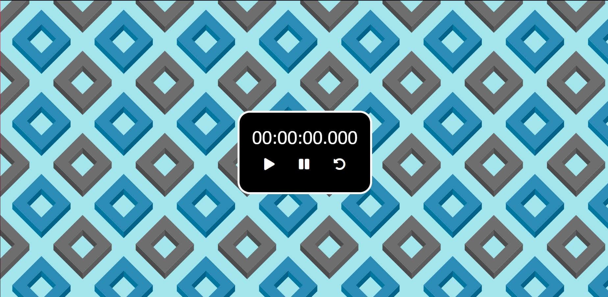
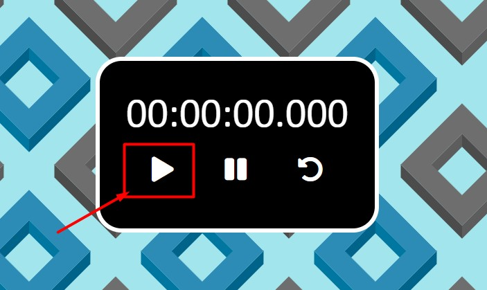
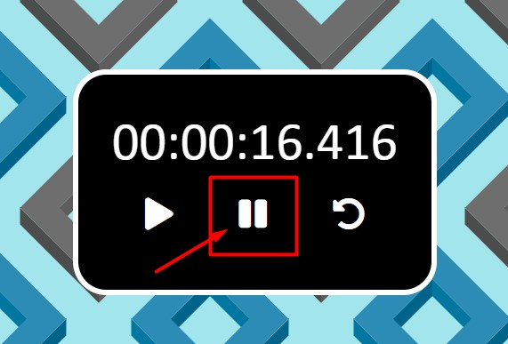
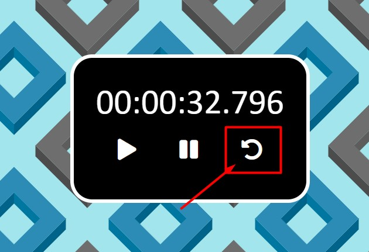
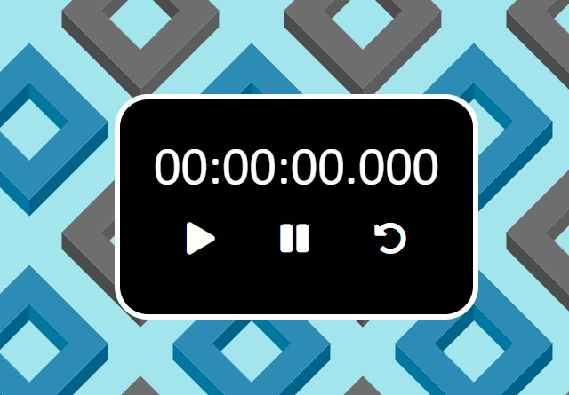

# Cronometro
un Cronometro Web que nos permite correr el tiempo, pausar o reiniciar el tiempo. hecho en HTML, CSS  y JavaScript

  
    
  
    
  
  

## ¿Cuál es el fin de este proyecto?
Es una simple pagina hecha en HTML, CSS y JavaScript. 
Su objetivo no es mas que el aprendisaje y practica de herramientas que nos puede proporcionar JavaScript.

## ¿Puedo Probarlo en Linea? 
Si, Puedes probarlo en linea haciendo click [aqui](https://carlosorellana00.github.io/Cronometro/)

## ¿Cómo puedo probarlo de manera local en mi equipo?
puede copiarse directamente desde git a traves de comando o descargarse en un archivo Zip, el proyecto no requiere de ningun servicio de servidor para correrse
de manera local en una computadora.

## Modo de uso

El Programa se nos presenta de forma sensilla al abrir la vista.

    

Iniciamos dandole al botón play para empezar a correr el cronometro.

    

si queremos pausarlo solo debemos apretar el botón de pausa al centro del cronometro, deteniendo el tiempo.

    

si queremos reiniciar el cronometro solo debemos de apretar este botón que reiniciara la cuenta del cronometro

    

asi veremos como el contador vuelve a 0.

    

## Referencias:

- [Autor -> Jeff Aporta](https://www.youtube.com/c/JeffAportaa)
- [Video Original -> CRONÓMETRO EN JAVASCRIPT](https://www.youtube.com/watch?v=EkS5AIqednw&t=5s)
- [Fondo de Pantalla -> svgbackgrounds](https://www.svgbackgrounds.com)
